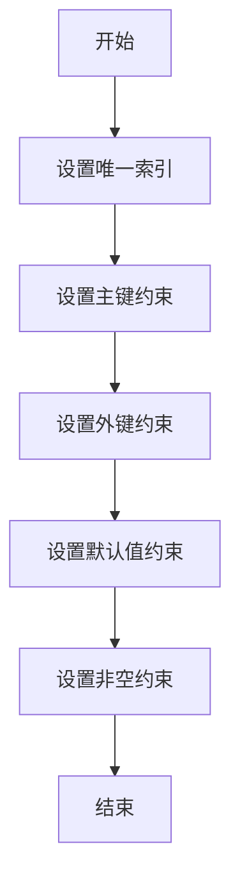

# 1. MySQL表结构设计的重要性

在MySQL数据库中，良好的表结构设计是确保数据库高效运行的基础。合理的表结构设计可以提高查询效率，减少数据冗余，确保数据完整性。一个好的表结构设计不仅能够提高数据库性能，还能够降低系统故障的风险。因此，在设计MySQL表结构时，需要考虑数据类型选择、主键与索引设计、规范化与反规范化等因素，以确保数据库的稳定性和高效性。

# 2. MySQL表结构设计要点解析

### 2.1 数据类型选择与优化
在设计MySQL表结构时，选择合适的数据类型对数据库性能和存储空间都至关重要。下面将分别介绍整数类型、浮点数类型和字符串类型的选择与优化。

#### 2.1.1 整数类型的选取
在MySQL中，整数类型是常用的数据类型之一，不同的整数类型在存储范围和存储空间上有所不同。一般情况下，根据实际需求选择合适的整数类型可以减少存储空间的占用，加快数据检索速度。

```sql
CREATE TABLE users (
    user_id INT,  -- 使用INT类型来存储用户ID
    ...
);
```

整数类型包括TINYINT、SMALLINT、INT和BIGINT等，根据数据范围的大小选择适当的整数类型，避免过度使用大容量的整数类型浪费空间。

#### 2.1.2 浮点数类型的合理运用
浮点数类型用于存储小数，包括FLOAT和DOUBLE两种常见类型。在设计表结构时，需要考虑小数位数的精度，避免存储过多的小数位导致数据精度丢失。

```sql
CREATE TABLE products (
    price DECIMAL(10, 2),  -- 使用DECIMAL类型存储价格，保留两位小数
    ...
);
```

根据实际需要选择合适的浮点数类型，并设置合理的精度，以确保数据准确性。

#### 2.1.3 字符串类型的处理
字符串类型在MySQL中有多种选择，包括CHAR、VARCHAR和TEXT等。在选择字符串类型时，需要考虑字段长度和存储方式，避免过度使用占用空间。

```sql
CREATE TABLE articles (
    title VARCHAR(100),  -- 使用VARCHAR存储文章标题
    content TEXT,        -- 使用TEXT存储文章内容
    ...
);
```

合理选择字符串类型，并根据实际内容长度设定合适的字段长度，可以提高数据库性能。

### 2.2 主键与索引设计
主键和索引是数据库中用于优化查询的重要设计元素。正确选择主键和建立适当的索引可以提高查询效率并保证数据完整性。

#### 2.2.1 主键的选择与唯一性
在设计表结构时，选择合适的主键对于数据的唯一标识和索引效率至关重要。通常情况下，使用自增主键可以有效提高查询效率。

```sql
CREATE TABLE orders (
    order_id INT PRIMARY KEY AUTO_INCREMENT,  -- 使用order_id作为自增主键
    ...
);
```

主键的选择应确保唯一性，并避免使用具有业务含义的字段作为主键，以免影响数据的准确性。

#### 2.2.2 索引的建立及影响
在MySQL中，索引可以加快数据检索的速度，提高查询性能。建立适当的索引需要考虑查询频率高的字段以及组合索引的使用情况。

```sql
CREATE INDEX idx_username ON users(username);  -- 为username字段创建索引
```

需要注意的是，过多的索引会增加数据库的存储空间和维护成本，因此需要根据实际情况合理设计索引。

#### 2.2.3 合适的索引类型选择
MySQL中不同的索引类型包括普通索引、唯一索引、全文索引等。根据实际需求选择合适的索引类型可以提高查询效率。

```sql
CREATE UNIQUE INDEX idx_email ON users(email);  -- 创建唯一索引
```

根据表的查询类型和业务需求，选择合适的索引类型进行优化，以提高数据库性能。

以上是关于MySQL表结构设计要点的解析，通过合理选择数据类型和优化主键索引设计，可以有效提升数据库性能并保证数据的完整性。接下来将进入第三章，探讨优化数据库查询性能的相关内容。

# 3. 优化数据库查询性能

在数据库应用中，优化查询性能是至关重要的，能够有效提高系统的响应速度和资源利用率。本章将深入探讨如何优化数据库查询性能，包括查询语句的优化、索引优化以及处理大数据量时的优化策略。

### 3.1 查询语句优化
在编写查询语句时，合理的语句结构和条件设计对于查询性能至关重要。下面我们将从 WHERE 条件的写法、避免使用 SELECT * 和 JOIN 使用技巧等方面来进行优化。

#### 3.1.1 WHERE条件的写法
WHERE 条件中的写法会直接影响到查询的效率，常见的写法如下：
- 尽量避免在 WHERE 条件中对字段进行函数运算，如 `WHERE YEAR(create_time) = 2022`，这会导致全表扫描；
- 使用合适的索引列作为 WHERE 条件；
- 避免在 WHERE 条件中对字段进行类型转换，如 `WHERE id = '123'`，会导致全表扫描。

```sql
-- 优化前
SELECT * FROM users WHERE YEAR(create_time) = 2022;

-- 优化后
SELECT * FROM users WHERE create_time >= '2022-01-01' AND create_time < '2023-01-01';
```

#### 3.1.2 避免使用 SELECT *
使用 `SELECT *` 会查询表中所有字段，包括不必要的字段，增加了数据传输的开销。应该明确指定需要查询的字段。

```sql
-- 不推荐
SELECT * FROM orders WHERE status = 'paid';

-- 推荐
SELECT order_id, order_time, total_amount FROM orders WHERE status = 'paid';
```

#### 3.1.3 JOIN使用技巧
在使用 JOIN 进行表连接时，应该注意以下几点：
- 尽量避免在 JOIN 条件中进行函数运算，会影响索引的使用；
- 对于大表的连接，应该考虑合适的数据分页和条件过滤。

```sql
-- 不推荐
SELECT * FROM orders JOIN users ON orders.user_id = users.id WHERE users.status = 'active';

-- 推荐
SELECT orders.order_id, orders.order_time, users.username 
FROM orders 
JOIN users ON orders.user_id = users.id 
WHERE users.status = 'active';
```

### 3.2 索引优化
索引在提高查询性能方面起着关键作用，正确地选择和使用索引能够显著减少查询时间。接下来我们将介绍了解 MySQL 索引类型、索引的创建与维护以及索引覆盖优化的相关内容。

#### 3.2.1 了解MySQL索引类型
MySQL中常见的索引类型包括：普通索引、唯一索引、主键索引、全文索引等。根据不同场景选择合适的索引类型。

#### 3.2.2 索引的创建与维护
在创建索引时，应该注意以下几点：
- 为经常用于条件筛选、排序或连接的列创建索引；
- 避免创建过多的索引，会增加写操作的开销；
- 定期对索引进行维护，删除无用的索引，重建磁盘碎片化过多的索引。

```sql
-- 创建索引
CREATE INDEX idx_username ON users(username);

-- 维护索引
ANALYZE TABLE users;
```

#### 3.2.3 索引覆盖优化
索引覆盖是指查询的结果可以仅通过索引来获取，不必再回表查询数据行，减少了查询成本。

```sql
-- 索引覆盖优化
SELECT order_id, order_time FROM orders WHERE status = 'paid';
```

### 3.3 数据量大时的优化
处理大数据量的查询时，常规的优化手段已经不能满足需求，此时应该考虑分区表的使用以及水平与垂直拆分。

#### 3.3.1 分区表的使用
对于数据量大的表，可以考虑使用分区表进行存储，可以提高查询效率和减少维护成本。

```sql
-- 使用分区表
CREATE TABLE orders (
    ...
) PARTITION BY RANGE (YEAR(order_time)) (
    PARTITION p0 VALUES LESS THAN (2020),
    PARTITION p1 VALUES LESS THAN (2021),
    PARTITION p2 VALUES LESS THAN (2022)
);
```

#### 3.3.2 垂直与水平拆分
对于复杂的数据表，可以考虑将其拆分成多个表，减少单表的数据量；也可以将一个大表按行进行分割存储在不同的表中，减少每张表的数据量。

```sql
-- 垂直拆分
CREATE TABLE orders_main (
    order_id INT PRIMARY KEY,
    ...
);

CREATE TABLE orders_details (
    order_id INT,
    FOREIGN KEY (order_id) REFERENCES orders_main(order_id),
    ...
);

-- 水平拆分
CREATE TABLE orders_2022 (
    ...
);
```

通过对查询语句的优化、索引的优化以及处理大数据量时的优化，可以有效提升数据库的查询性能，提升系统的整体性能和用户体验。

# 4.1 缺乏适当约束与规范

在进行MySQL表结构设计时，经常会出现一些缺乏适当约束与规范的情况，这可能会导致数据的不完整性和一致性问题，甚至会引发数据混乱和错误。因此，我们需要重视在设计表结构时的约束条件设置。

#### 4.1.1 忽视数据完整性

数据完整性是数据库设计中至关重要的一环，而在实际工作中，有时会因为忽视数据完整性而导致数据不完整的情况。例如，在设计用户信息表时，如果没有设置用户名字段为唯一索引，可能会导致出现多个用户使用相同用户名的问题，破坏了数据的唯一性。

为避免这种情况，我们在设计表结构时，应该根据实际业务需求，设置适当的约束条件和索引，确保数据的完整性和一致性。例如，在上述用户信息表中，可以通过在用户名字段上添加唯一索引，来保证用户名的唯一性。

```sql
CREATE TABLE user_info (
    id INT PRIMARY KEY,
    username VARCHAR(50) UNIQUE,
    password VARCHAR(50),
    email VARCHAR(50)
);
```

#### 4.1.2 约束条件的制定

除了唯一索引外，还可以通过设置外键约束、默认值约束、非空约束等方式来保证数据的完整性。在设计表结构时，要考虑到各字段之间的关联性，合理设置约束条件，避免数据之间的不一致和冲突。

例如，在设计订单表时，可以通过外键约束确保订单表中的用户id在用户信息表中存在，以保证订单数据的有效性。

```sql
CREATE TABLE orders (
    order_id INT PRIMARY KEY,
    user_id INT,
    amount DECIMAL(10, 2),
    FOREIGN KEY (user_id) REFERENCES user_info(id)
);
```

通过合理设置约束条件，我们可以有效避免数据不完整性问题，提高数据的质量和稳定性，确保数据库系统的正常运行。

### 数据表格

下表总结了在MySQL表结构设计过程中，常见的约束条件及其作用：

| 约束类型     | 作用                 |
|------------|---------------------|
| 唯一索引     | 保证字段值的唯一性      |
| 主键约束     | 唯一标识表中的每一行数据 |
| 外键约束     | 确保字段与其他表的关联性  |
| 默认值约束    | 在未指定值时自动填充默认值 |
| 非空约束     | 禁止字段的值为空       |

通过合理使用上述约束条件，可以有效规范表结构设计，提高数据的完整性和一致性。

### mermaid流程图



以上是关于缺乏适当约束与规范可能导致的问题以及如何通过设置约束条件来规避这些问题的详细介绍。在进行MySQL表结构设计时，务必重视数据完整性和一致性，合理设置约束条件，以确保数据库系统的稳定运行。

# 5. 实例分析：典型MySQL表结构设计案例

在前面的章节中，我们已经了解了MySQL表结构设计的重要性、设计要点的解析以及优化数据库查询性能的相关内容。接下来，我们将通过实例分析来深入探讨典型的MySQL表结构设计案例，通过实际案例的分析，加深对表结构设计的理解，并学习如何在实际项目中应用这些知识。

### 5.1 场景介绍

假设我们是一家电商平台，需要设计一个用户订单管理系统。在这个系统中，涉及到用户信息、订单信息、商品信息等数据的存储和管理。接下来，我们将针对这一场景设计相应的MySQL表结构。

### 5.2 数据库表设计

#### 5.2.1 用户信息表（users）

首先，我们需要设计用户信息表，用于存储用户的基本信息，例如用户ID、用户名、手机号码等。

```sql
CREATE TABLE users (
    user_id INT PRIMARY KEY,
    username VARCHAR(50) NOT NULL,
    phone VARCHAR(11) UNIQUE
);
```

- `user_id`：用户ID，作为主键，保证唯一性。
- `username`：用户名，限定为不为空的字符串。
- `phone`：手机号码，设置为唯一索引，保证唯一性。

#### 5.2.2 订单信息表（orders）

接下来，我们设计订单信息表，用于存储用户的订单信息，包括订单ID、用户ID、订单金额等字段。

```sql
CREATE TABLE orders (
    order_id INT PRIMARY KEY,
    user_id INT,
    amount DECIMAL(10, 2),
    FOREIGN KEY (user_id) REFERENCES users(user_id)
);
```

- `order_id`：订单ID，作为主键，保证唯一性。
- `user_id`：用户ID，与用户信息表关联。
- `amount`：订单金额，使用`DECIMAL`类型存储。

#### 5.2.3 商品信息表（products）

最后，我们设计商品信息表，用于存储商品的信息，包括商品ID、商品名称、价格等。

```sql
CREATE TABLE products (
    product_id INT PRIMARY KEY,
    product_name VARCHAR(100) NOT NULL,
    price DECIMAL(10, 2)
);
```

- `product_id`：商品ID，作为主键，保证唯一性。
- `product_name`：商品名称，限定为不为空的字符串。
- `price`：商品价格，使用`DECIMAL`类型存储。

### 5.3 数据库表关系分析

根据上述设计，我们可以得出以下数据库表之间的关系：

- 用户信息表（users）与订单信息表（orders）之间是一对多关系，即一个用户可以对应多个订单。
- 订单信息表（orders）与商品信息表（products）之间是多对一关系，即多个订单对应一个商品。

### 5.4 数据库操作示例

下面我们给出一个简单的数据库操作示例，展示如何向用户信息表中插入一条用户数据：

```sql
INSERT INTO users (user_id, username, phone) VALUES (1, 'Alice', '12345678901');
```

通过以上操作，我们成功向用户信息表中插入了一条用户数据，用户ID为1，用户名为Alice，手机号码为12345678901。

### 表格展示

接下来，我们通过表格的形式展示各表的结构设计，以便更直观地查看：

| Table Name | Columns               |
|------------|-----------------------|
| users      | user_id, username, phone |
| orders     | order_id, user_id, amount |
| products   | product_id, product_name, price |

在这个表格中，清晰地列出了每个表所包含的字段信息，方便查看和比对。

### 总结

通过本实例分析，我们深入了解了典型的MySQL表结构设计案例，包括设计思路、表结构设计、表关系分析以及数据库操作示例。通过实际案例的学习，我们能更好地应用表结构设计的知识到实陃项目中，提高数据库设计的质量和效率。

在下一章中，我们将继续探讨优化案例，并对前面所学内容进行更深入的总结和探讨。

# 6. 优化案例探讨与总结

在实际的MySQL表结构设计和优化过程中，经常会遇到各种性能瓶颈和问题。本章将通过一个具体的案例来展示如何优化MySQL表结构设计，以提高系统的性能和可靠性。

### 优化案例背景

假设我们有一个在线商城系统，其中的订单表(order_table)和商品表(product_table)是系统中的两张核心表。由于订单表和商品表数据量巨大，查询频繁，现在我们需要对这两张表进行结构设计优化，以提升系统性能。

### 优化案例步骤

#### 1. 优化订单表(order_table)

首先，我们针对订单表(order_table)进行优化。当前订单表结构如下：

| 列名           | 数据类型      | 备注                      |
|----------------|--------------|--------------------------|
| order_id       | INT          | 订单ID，主键              |
| customer_id    | INT          | 客户ID                    |
| product_id     | INT          | 商品ID                    |
| amount         | DECIMAL      | 订单金额                  |
| create_time    | DATETIME     | 订单创建时间              |

针对这个订单表，我们可以进行以下优化步骤：
```sql
-- 为订单表添加索引
CREATE INDEX idx_customer_id ON order_table(customer_id);

-- 对订单金额字段进行数据类型调整
ALTER TABLE order_table MODIFY amount DECIMAL(10, 2);
```

#### 2. 优化商品表(product_table)

接下来，我们继续对商品表(product_table)进行优化。当前商品表结构如下：

| 列名           | 数据类型      | 备注                      |
|----------------|--------------|--------------------------|
| product_id     | INT          | 商品ID，主键              |
| product_name   | VARCHAR(50)  | 商品名称                  |
| price          | DECIMAL      | 商品价格                  |
| stock          | INT          | 商品库存                  |
| create_time    | DATETIME     | 商品创建时间              |

对于商品表，我们可以执行如下优化操作：
```sql
-- 为商品表添加索引
CREATE INDEX idx_product_name ON product_table(product_name);

-- 增加适当的唯一性约束
ALTER TABLE product_table ADD UNIQUE INDEX unique_product_name(product_name);
```

### 优化案例总结

通过以上优化操作，我们可以明显改善订单表和商品表的查询性能和数据完整性。在实际项目中，表结构设计的合理性和索引的合理应用是关键因素，同时避免过度冗余和不必要的字段设计也是优化的重点。

优化数据库表结构是一个不断优化和改进的过程，需要结合具体业务场景和实际性能需求来进行设计和调整，通过持续优化来提升系统的整体性能和稳定性。

以上是优化案例的探讨和总结，希望对你在实际项目中的表结构设计和优化过程有所帮助。
