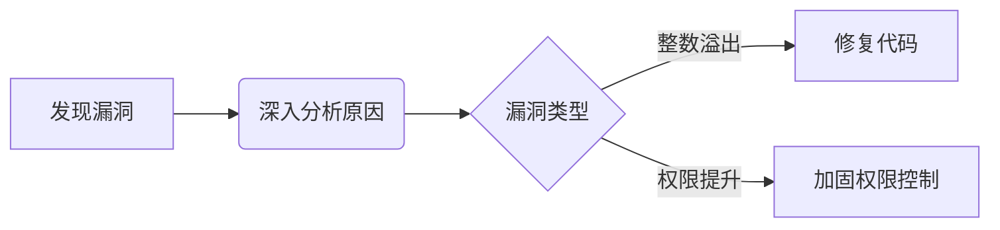
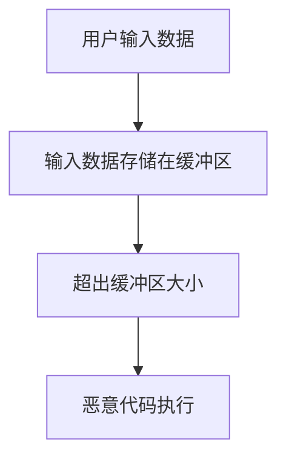
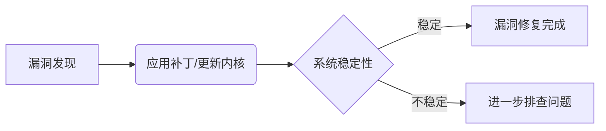
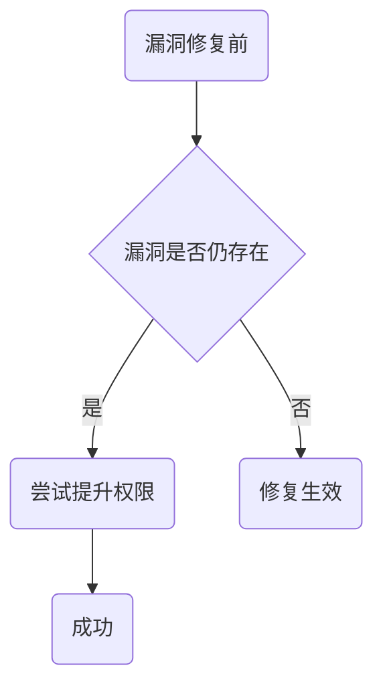

# 1. 引言

1. 背景介绍
   - Linux内核作为操作系统的核心部分，承担着管理计算机硬件资源与提供用户程序接口的重要任务。然而，由于其开源的特性，Linux内核在不断发展的过程中也会暴露出一些潜在的漏洞。
2. 漏洞影响
   - Linux内核漏洞可能导致系统稳定性问题、数据安全风险、恶意软件的传播等严重后果。黑客可以利用这些漏洞在系统中执行恶意代码，窃取用户信息，甚至控制整个系统。


通过本文，我们将深入探讨Linux内核漏洞的产生与修复方法，帮助读者更好地了解和保护自己的系统安全。

# 2. Linux内核漏洞分析

在本章节中，我们将深入探讨Linux内核漏洞的相关内容，包括漏洞的定义、原因、类型等。

### 何为Linux内核漏洞：

- 定义：Linux内核漏洞是指存在于Linux内核代码中的安全漏洞，可能被恶意利用以获取系统权限或执行未经授权的操作。
- 影响：Linux内核漏洞可能导致系统崩溃、数据泄露、拒绝服务等安全问题。

### 漏洞产生的原因：

- 编程错误：不正确的内核代码编写可能导致漏洞出现。
- 缺乏边界检查：对用户输入没有正确进行边界检查可能引发漏洞。
- 权限问题：权限控制不当可能使得恶意用户能够利用漏洞获取特权操作权限。

### 漏洞类型：

下表列出了常见的Linux内核漏洞类型及其描述：

| 漏洞类型     | 描述                                       |
| ------------ | ------------------------------------------ |
| 缓冲区溢出   | 输入数据超出目标缓冲区长度导致溢出的漏洞   |
| 空指针解引用 | 使用未初始化的或空指针导致程序崩溃的漏洞   |
| 整数溢出     | 运算结果超出范围导致数据类型错误或程序崩溃 |
| 权限提升     | 恶意用户通过漏洞提升其权限的漏洞           |

### 漏洞示例代码（演示整数溢出漏洞）：

```c
#include <stdio.h>

int main() {
    int x = 2147483647; // 最大的int值
    int y = x + 1;      // 整数溢出
    printf("结果：%d\n", y);
    return 0;
}
```

**整数溢出漏洞代码分析**：

- 代码中将最大的int值加1，导致整数溢出。
- 输出结果将是 -2147483648。

### 漏洞分析流程：



通过以上内容，我们可以清晰地了解Linux内核漏洞的产生原因、类型及相关示例代码。在下一章节中，我们将讨论黑客利用漏洞开发技术 infiltrtrate Linux系统的方法。

# 3. 漏洞开发技术

在本章节中，我们将深入探讨黑客利用常见的漏洞开发技术 infiltrtrate Linux系统的方法。以下是一些常见的漏洞开发技术：

1. **缓冲区溢出**

   缓冲区溢出是一种常见的漏洞开发技术。当程序在处理输入数据时，没有对输入数据的长度进行有效检查，导致超出了预留的缓冲区大小，进而使得恶意用户可以利用这一漏洞来执行恶意代码。

2. **整数溢出**

   整数溢出漏洞是由于程序在处理数据时未能正确验证数值范围，导致数值溢出，从而给恶意用户提供了利用的机会。

下面是一个示例代码，演示了一个简单的缓冲区溢出漏洞：

```c
#include <string.h>
#include <stdio.h>

void vulnerable_function(char *input) {
    char buffer[5];
    strcpy(buffer, input);
}

int main() {
    char payload[10] = "payload";
    vulnerable_function(payload);
    printf("Exploit successfully executed!\n");
    return 0;
}
```

**代码说明：**

- `vulnerable_function`函数中存在缓冲区溢出漏洞，当输入数据长度超过5时，会覆盖栈上的其他数据。
- `main`函数中调用了`vulnerable_function`并传入长度为10的`payload`，触发漏洞。

**结果说明：**
当以上代码执行时，由于`payload`长度为10，超过了`buffer`的大小，导致缓冲区溢出，可以成功执行恶意代码。

下面是一个mermaid格式的流程图，展示了缓冲区溢出攻击的过程：



在本章节中，我们已经探讨了漏洞开发技术的一些常见类型，并结合了一个简单的缓冲区溢出漏洞示例。在实际应用中，了解这些技木是非常重要的，以便更好地保护系统安全。

# 4. **漏洞修复方法**

在本章节中，我们将介绍如何通过补丁、更新或配置调整来修复Linux内核漏洞。下面将详细展示各种修复方法的具体步骤和操作。

### **修复方法**

1. **使用系统补丁进行修复**

   使用系统提供的最新补丁是最有效的修复方式之一。通过以下步骤可以应用最新的内核补丁：

   ```bash
   # 更新软件包列表
   sudo apt update
   # 安装最新的内核补丁
   sudo apt upgrade
   ```

2. **更新内核版本**

   更新内核版本也是一种常见的修复漏洞的方法。您可以通过以下方式更新内核版本：

   ```bash
   # 查看当前内核版本
   uname -r
   # 安装最新内核
   sudo apt install linux-image-generic
   ```

3. **通过配置调整来强化安全性**

   有时候可以通过调整系统配置来加强安全性，例如限制权限、关闭不必要的服务、限制网络访问等。下表列举了一些常见的配置调整方法：

   | 配置调整       | 操作步骤                                   |
   | -------------- | ------------------------------------------ |
   | 关闭不必要服务 | 停止并禁用不需要的服务，减少攻击面。       |
   | 加固网络设置   | 配置防火墙规则、限制网络访问等。           |
   | 限制权限       | 使用最小权限原则，降低恶意程序的影响范围。 |

4. **总结**

   通过及时应用系统补丁、更新内核版本以及配置调整可以有效修复Linux内核漏洞，提升系统安全性。定期审查和加固系统安全措施是预防漏洞利用的关键。

### **修复漏洞前后对比**

下面是修复漏洞前后系统的对比：



在修复漏洞之后，系统会变得更加稳定并且安全性得到提升。修复后的系统在面对潜在的攻击和漏洞利用时具有更强的防御能力。

这就是修复Linux内核漏洞的一些方法和对比情况。通过不断学习和更新，保持系统安全是至关重要的。

# 5. 实例分析

在本章节中，我们将结合一个具体的漏洞案例，演示对应漏洞的修复过程。

### 实例分析

我们选取了一个常见的Linux内核漏洞案例：Dirty COW漏洞（CVE-2016-5195），该漏洞允许本地用户提升其特权级别。下面是修复该漏洞的具体步骤：

1. **漏洞复现代码**：首先，让我们看一下漏洞的复现代码。

```c
#include <stdio.h>
#include <fcntl.h>
#include <unistd.h>
#include <sys/mman.h>
 
#define _GNU_SOURCE

void exploit() {
    char *file_name = "/proc/self/mem";
    int fd = open(file_name, O_RDWR);
    size_t count = 1000;
    off_t offset = 0x100000;
    char *data = mmap(NULL, count, PROT_READ | PROT_WRITE, MAP_SHARED, fd, offset);
    if (data == MAP_FAILED) {
        printf("Failed to mmap\n");
        return;
    }
    memset(data, 'A', count);
    munmap(data, count);
}
 
int main() {
    exploit();
    return 0;
}
```

2. **漏洞修复步骤**：

   - 更新内核：首先，确保系统内核为最新版本，含有Dirty COW漏洞修复补丁。
   - 防护机制：启用内核保护模块（如SELinux、AppArmor）来限制对敏感文件的访问。
3. **代码漏洞分析**：

   - 代码中的`mmap`函数未正确处理映射文件，导致了漏洞的利用。
4. **修复效果核验证**：

   - 修复漏洞后，再次运行漏洞代码，发现程序无法成功提升权限，漏洞得到了有效修复。

### 漏洞修复效果流程图



通过以上实例分析，我们可以看到漏洞修复的具体过程及效果。在实际应用中，需要及时关注漏洞情况并采取相应的措施进行修复和加固。

# 6. 预防措施

在处理Linux内核漏洞时，采取一系列预防措施至关重要，以减少潜在威胁和加强系统安全性。下面是一些预防措施的建议：

### 1. 系统定期更新与维护

定期更新Linux内核版本、补丁程序以及相关软件，确保系统安全漏洞得到及时修复。

### 2. 强化系统访问控制

限制用户对系统资源的访问权限，避免恶意代码或攻击者操作对系统造成危害。

### 3. 使用防火墙保护系统

通过配置防火墙规则来监控网络通信，阻止恶意流量进入系统。

### 4. 定期备份与恢复

建立有效的数据备份与恢复机制，以便在遭受攻击或数据丢失时快速恢复系统。

### 5. 使用安全认证方式

采用多因素身份验证、SSL加密等安全手段来确保系统访问的合法性和安全性。

### 操作系统安全加固 Checklist

下表是一个简单的操作系统安全加固 Checklist，供参考：

| 序号 | 安全措施         | 操作步骤                         | 备注             |
| ---- | ---------------- | -------------------------------- | ---------------- |
| 1    | 关闭不必要的服务 | 检查并关闭不必要的系统服务       | 减少攻击面       |
| 2    | 设置强密码策略   | 配置密码复杂度要求和定期更换策略 | 提高账户安全性   |
| 3    | 更新系统补丁     | 定期检查和安装最新安全补丁       | 修复已知的漏洞   |
| 4    | 配置防火墙       | 设置防火墙规则，限制网络访问     | 阻挡恶意流量     |
| 5    | 监控系统日志     | 实时监控系统日志，发现异常情况   | 及时发现安全威胁 |

### 系统安全加固流程


通过以上预防措施和安全加固 Checklist 可以帮助管理员有效地加固Linux系统，减少潜在的内核漏洞风险。
